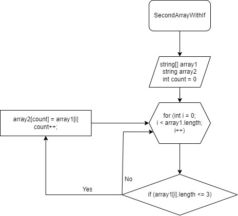

# TaskFinal01

# ИТОГОВАЯ ПРОВЕРОЧНАЯ РАБОТА

### 1. Создать репозиторий на GitGub:

        https://github.com/H43apo8/TaskFinal01.git

### 2. Нарисовать блок схему алгоритма:

Блок схема Алгоритма

### 3. Снабдить репозиторий текстовым описанием решения:

Сначала объявляется два массива: первый и второй такой же длины. 
Затем идёт метод, в котором присутствует цикл соразмерный длине 
массива, внутри цикла проверка условия ( <=3 ), если да элемент 
первого массива заносится в count элемент второго массива. Переменная 
count нужна чтобы поочередно закидывать из первого массива во второй 
а также чтобы потом не было пробелов. После присвоения увеличивается 
переменная count на 1 и возвращается к циклу for в котором i увеличивается
 на 1. И так проверяется до конца.

### 4. Написать программу, решающую поставленную задачу:

    Console.Clear();
    string[] array1 = new string[5] { "hello", "2", "hello", "world", ":-)" };
    string[] array2 = new string[array1.Length];
    int count = 0;

    void SecondArrayWithIF(string[] array1, string[] array2)
    {
    int count = 0;
    for (int i = 0; i < array1.Length; i++)
    {
        if (array1[i].Length <= 3)
        {
            array2[count] = array1[i];
            count++;
        }
    }
    }
    void PrintArray(string[] array)
    {
    for (int i = 0; i < array.Length; i++)
    {
        Console.Write($"{array[i]} ");
    }
    Console.WriteLine();
    }
    SecondArrayWithIF(array1, array2);
    PrintArray(array2);

